# Architecture Diagrams & Visualizations

**Document Version:** 1.0
**Last Updated:** 2026-01-01
**Purpose:** Visual diagrams of the LLM architecture using Mermaid

---

## Table of Contents

1. [High-Level System Architecture](#high-level-system-architecture)
2. [Intent Extraction Flow](#intent-extraction-flow)
3. [Entity Extraction Flow](#entity-extraction-flow)
4. [Orchestration Flow](#orchestration-flow)
5. [Context Management](#context-management)
6. [Tool Execution Pipeline](#tool-execution-pipeline)
7. [Hybrid ML Approach](#hybrid-ml-approach)
8. [Data Flow Diagrams](#data-flow-diagrams)

---

## High-Level System Architecture

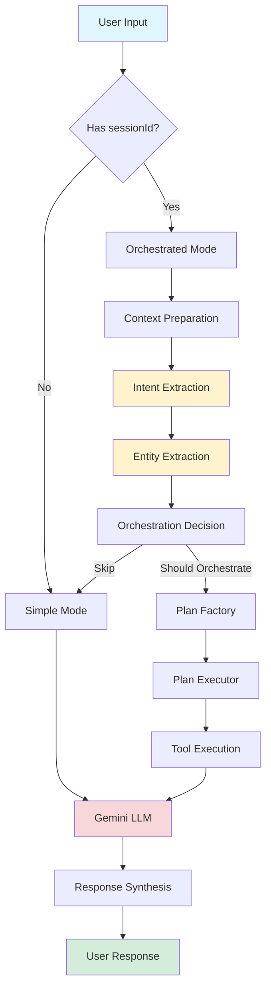

---

## Intent Extraction Flow

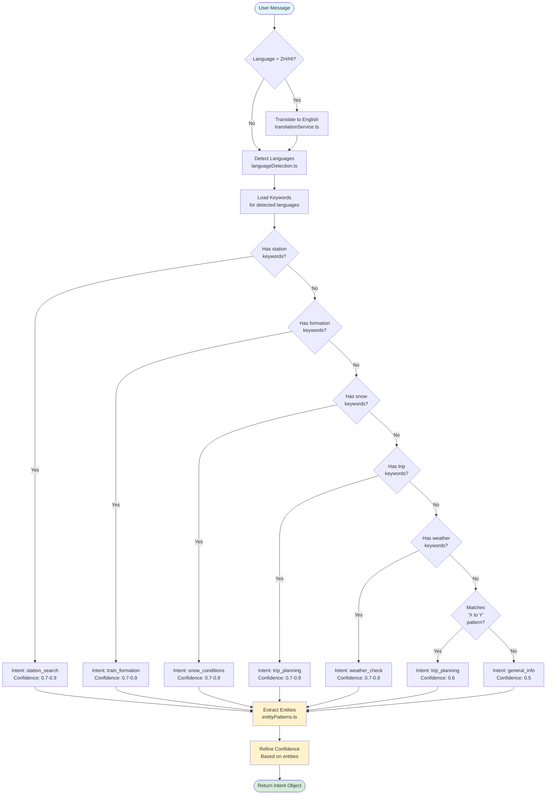

---

## Entity Extraction Flow

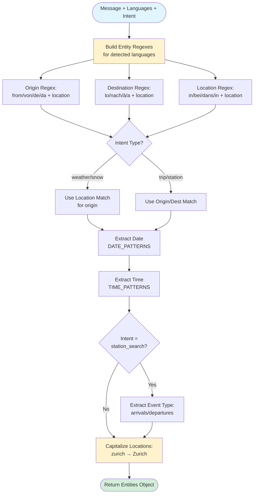

### Entity Regex Pattern Building

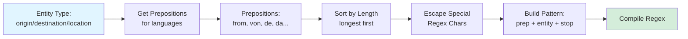

---

## Orchestration Flow

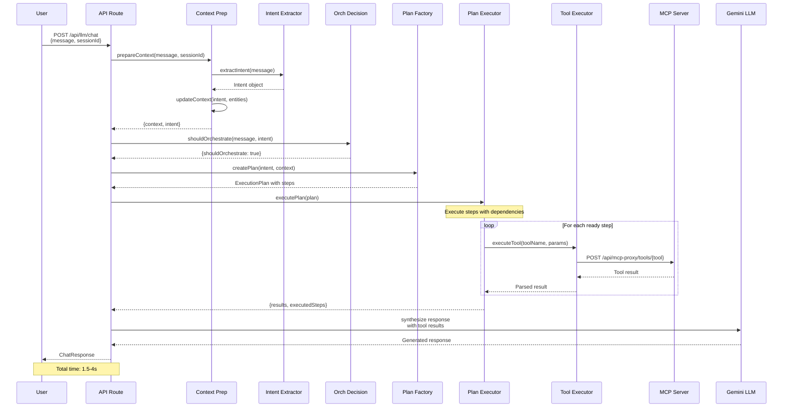

---

## Context Management

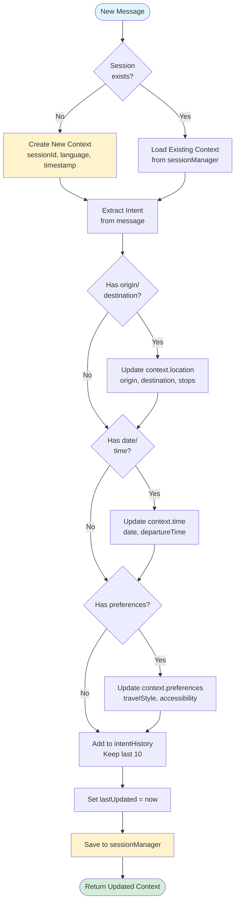

### Context Structure

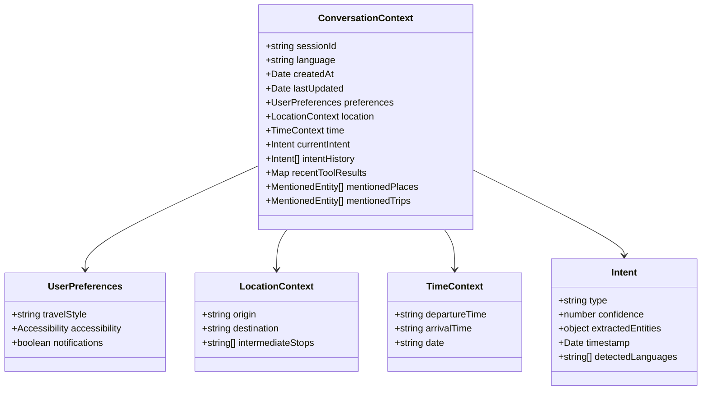

---

## Tool Execution Pipeline

```mermaid
flowchart TD
    Start([Execute Tool Call]) --> ResolveParams[Resolve Parameters<br/>toolResolverRegistry]

    ResolveParams --> CheckType{Param Type?}

    CheckType -->|Station Name| ResolveStation[Find UIC code<br/>findStopPlacesByName]
    CheckType -->|Location Name| ResolveCoords[Get coordinates<br/>geocoding service]
    CheckType -->|Simple Value| UseValue[Use as-is]

    ResolveStation --> SelectMode
    ResolveCoords --> SelectMode
    UseValue --> SelectMode

    SelectMode{Tool =<br/>findTrips?} -->|Yes| CheckParams{Has many<br/>params?}
    SelectMode -->|No| CallProxy

    CheckParams -->|Yes| UseStandard[responseMode:<br/>'standard'<br/>faster, less detail]
    CheckParams -->|No| UseDetailed[responseMode:<br/>'detailed'<br/>slower, more detail]

    UseStandard --> CallProxy
    UseDetailed --> CallProxy

    CallProxy[Call MCP Proxy<br/>POST /api/mcp-proxy/tools/{tool}] --> Retry{Success?}

    Retry -->|No & attempts < 3| Wait[Wait exponential<br/>backoff]
    Retry -->|No & attempts = 3| Error([Return Error])
    Retry -->|Yes| ParseResponse

    Wait --> CallProxy

    ParseResponse[Parse JSON Response<br/>Extract text content] --> Cache[Cache Result<br/>in recentToolResults]
    Cache --> Return([Return Tool Result])

    style Start fill:#e1f5ff
    style Return fill:#d4edda
    style Error fill:#f8d7da
    style CallProxy fill:#fff3cd
```

---

## Hybrid ML Approach

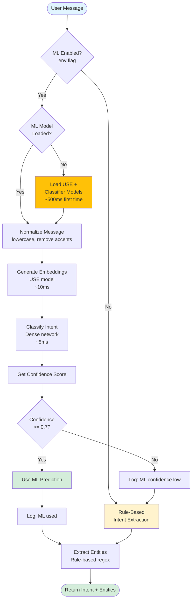

### ML Model Architecture

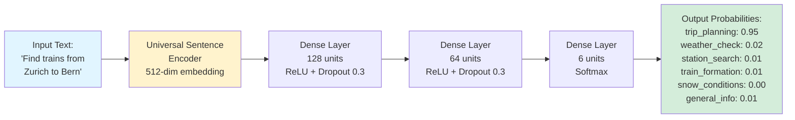

---

## Data Flow Diagrams

### Simple Chat Mode

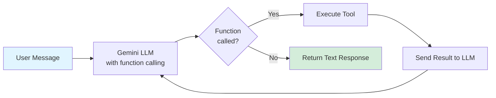

### Orchestrated Chat Mode

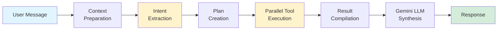

### Plan Execution with Dependencies

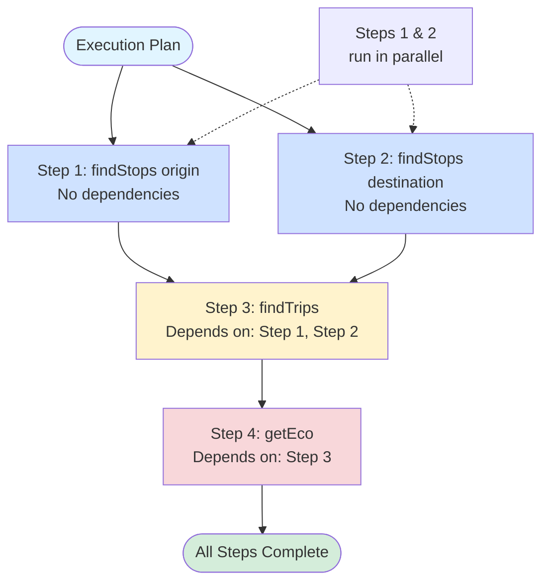

---

## Keyword Matching Priority

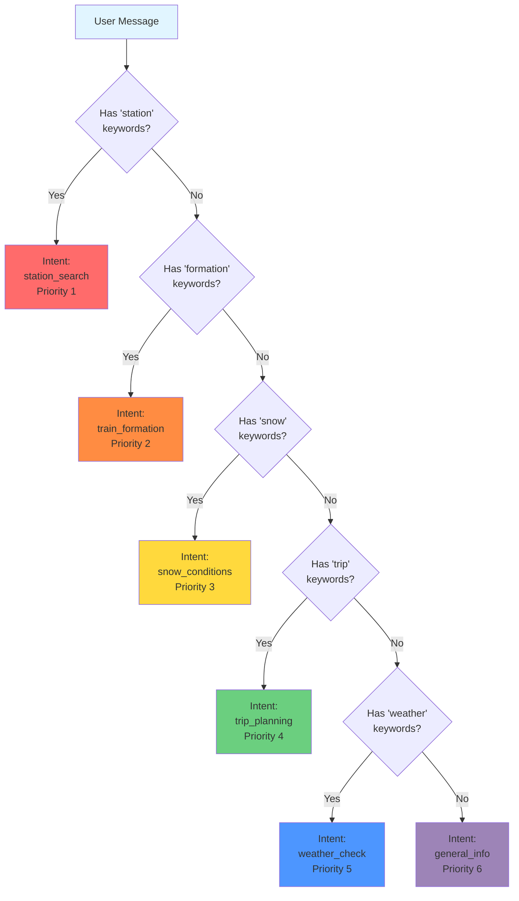

---

## Confidence Calculation Flow

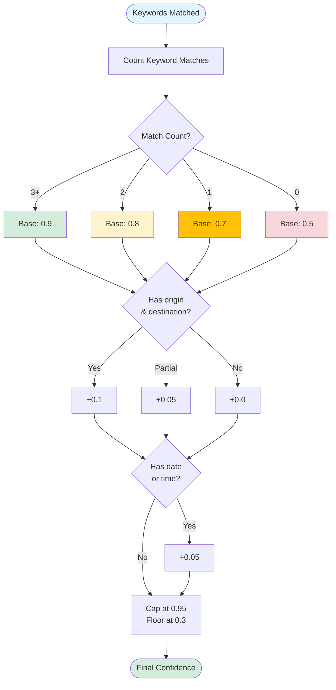

---

## Session Lifecycle

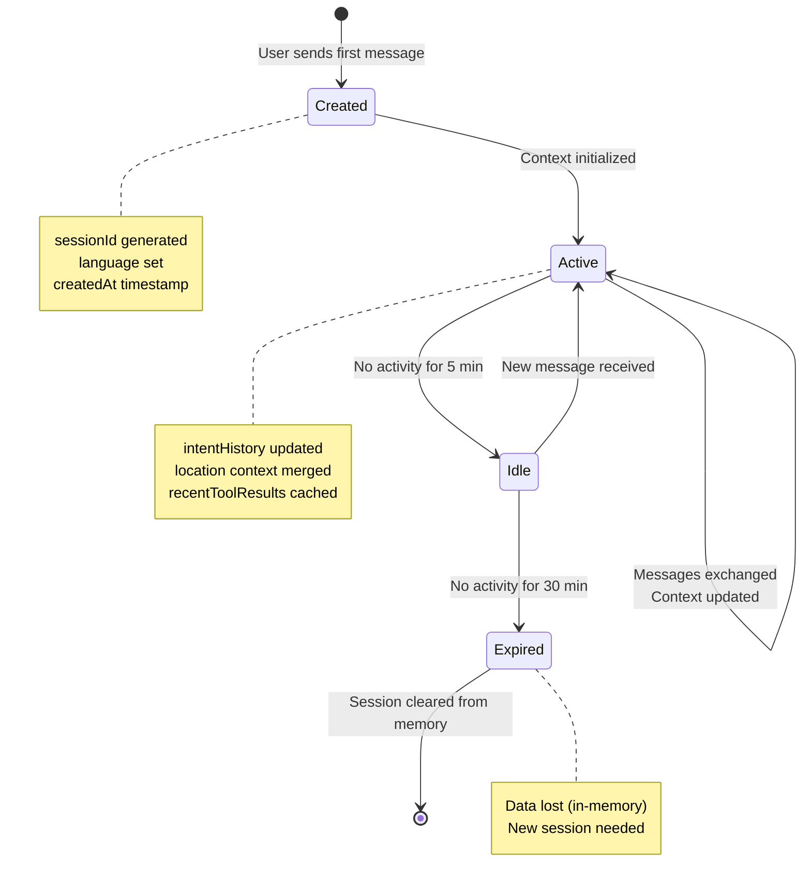

---

## Language Detection Decision Tree

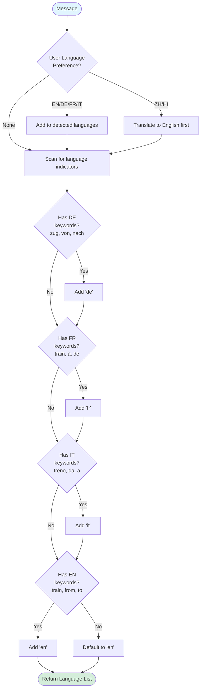

---

## Error Handling & Fallbacks

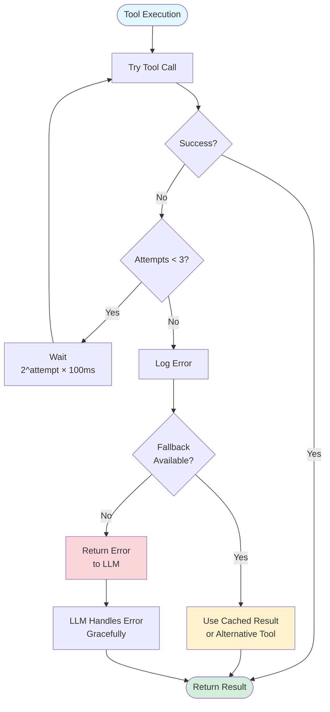

---

## Deployment Architecture

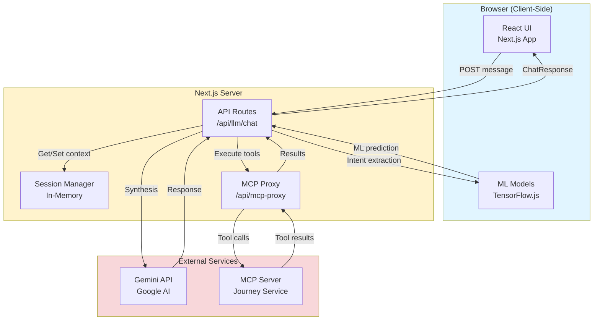

---

## Summary: Key Metrics

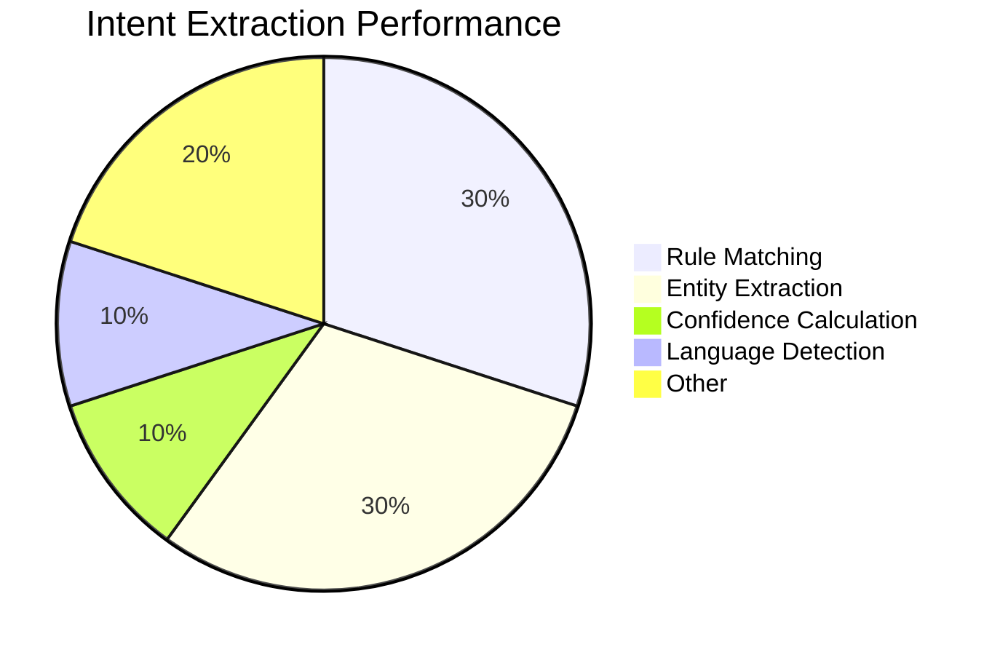

```mermaid
pie title Response Time Breakdown (Orchestrated Mode)
    "Tool Execution" : 60
    "LLM Synthesis" : 30
    "Intent/Entity Extraction" : 5
    "Context Management" : 5
```

---

**Document End**

**Note:** These diagrams can be viewed in any Markdown viewer that supports Mermaid syntax, including GitHub, GitLab, VS Code (with Mermaid extension), and many documentation platforms.
