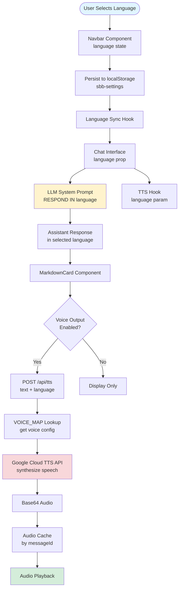
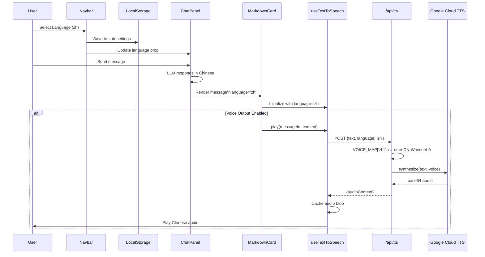
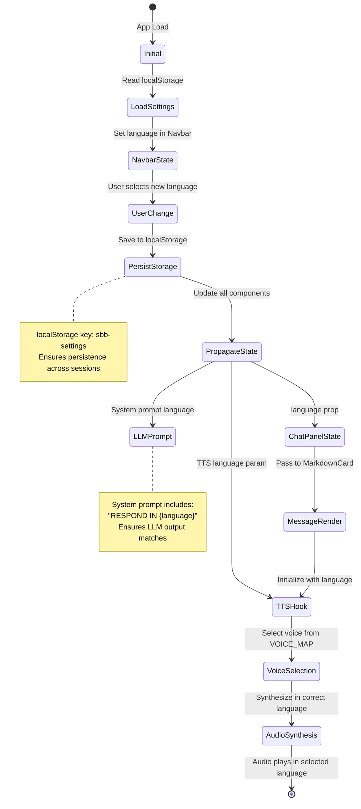
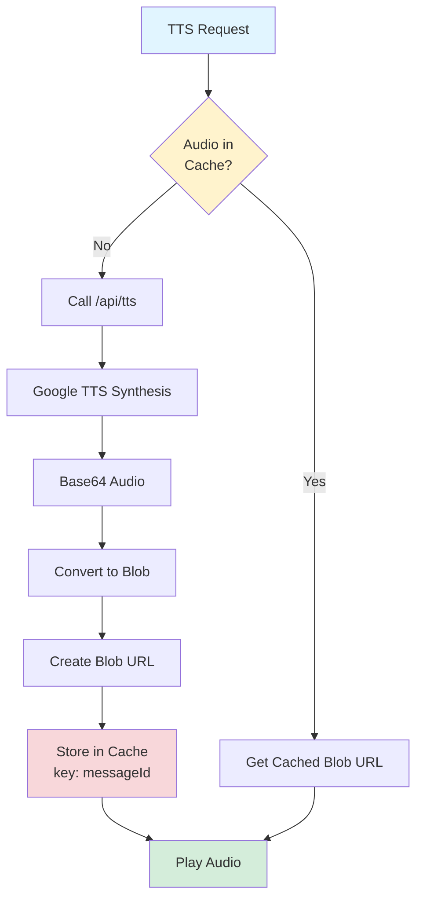
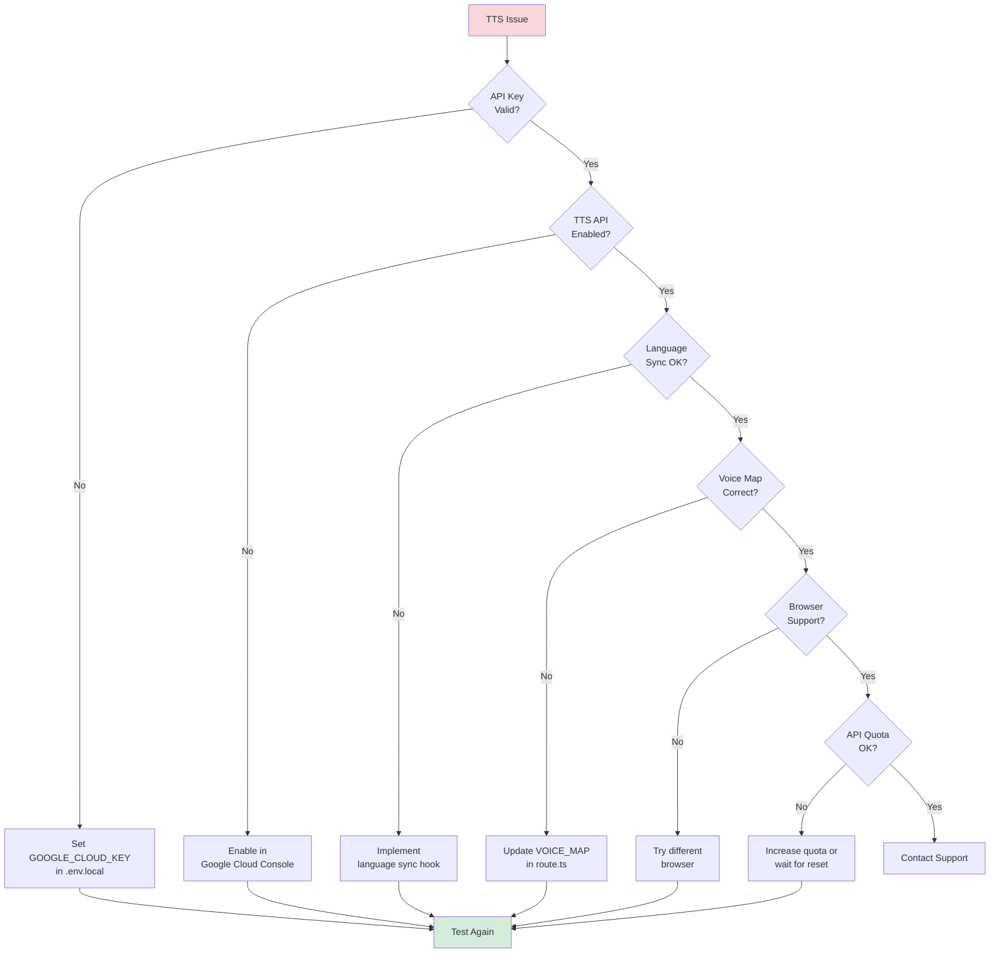

# i18n Voice Feature Architecture

**Document Version:** 1.0  
**Last Updated:** 2026-01-01  
**Purpose:** Comprehensive documentation of the internationalization (i18n) and Text-to-Speech (TTS) integration

---

## Table of Contents

1. [Overview](#overview)
2. [Architecture](#architecture)
3. [Language-Voice Mapping](#language-voice-mapping)
4. [State Synchronization](#state-synchronization)
5. [Implementation Details](#implementation-details)
6. [Testing Guide](#testing-guide)
7. [Troubleshooting](#troubleshooting)

---

## Overview

The Swiss Explorer application provides a fully integrated i18n voice feature that automatically selects the appropriate TTS voice based on the user's language preference. The system supports **6 languages** with native voice synthesis.

### Supported Languages

| Language | Code | Voice | Gender | Script |
|----------|------|-------|--------|--------|
| English | en | en-US-Neural2-F | Female | Latin |
| German | de | de-DE-Neural2-F | Female | Latin |
| French | fr | fr-FR-Neural2-A | Female | Latin |
| Italian | it | it-IT-Neural2-A | Female | Latin |
| Chinese | zh | cmn-CN-Wavenet-A | Neutral | CJK |
| Hindi | hi | hi-IN-Neural2-A | Neutral | Devanagari |

### Key Features

- ✅ **Automatic Language Detection**: TTS voice matches LLM response language
- ✅ **State Synchronization**: Language selection propagates across all components
- ✅ **Audio Caching**: Reduces API calls and improves performance
- ✅ **Auto-Play**: Optional automatic playback of assistant messages
- ✅ **Playback Controls**: Play, pause, resume, stop for each message

---

## Architecture

### High-Level Flow



### Component Interaction



---

## Language-Voice Mapping

### Voice Configuration

The voice mapping is defined in `/src/app/api/tts/route.ts`:

```typescript
const VOICE_MAP: Record<
  string,
  { languageCode: string; name: string; ssmlGender: 'NEUTRAL' | 'MALE' | 'FEMALE' }
> = {
  en: { languageCode: 'en-US', name: 'en-US-Neural2-F', ssmlGender: 'FEMALE' },
  de: { languageCode: 'de-DE', name: 'de-DE-Neural2-F', ssmlGender: 'FEMALE' },
  fr: { languageCode: 'fr-FR', name: 'fr-FR-Neural2-A', ssmlGender: 'FEMALE' },
  it: { languageCode: 'it-IT', name: 'it-IT-Neural2-A', ssmlGender: 'FEMALE' },
  zh: { languageCode: 'cmn-CN', name: 'cmn-CN-Wavenet-A', ssmlGender: 'NEUTRAL' },
  hi: { languageCode: 'hi-IN', name: 'hi-IN-Neural2-A', ssmlGender: 'NEUTRAL' },
};
```

### Voice Selection Logic

```mermaid
flowchart TD
    Request[TTS Request\ntext + language] --> GetVoice{language in\nVOICE_MAP?}
    
    GetVoice -->|Yes| UseVoice[Use Mapped Voice\nVOICE_MAP[language]]
    GetVoice -->|No| Fallback[Fallback to English\nVOICE_MAP.en]
    
    UseVoice --> BuildRequest[Build Google TTS Request]
    Fallback --> BuildRequest
    
    BuildRequest --> Config[Voice Config:\nlanguageCode\nname\nssmlGender]
    
    Config --> AudioConfig[Audio Config:\nencoding: MP3\nspeechRate: 1.0\npitch: 0]
    
    AudioConfig --> Synthesize[Google Cloud TTS\ntext:synthesize]
    Synthesize --> Return[Return Base64 Audio]
    
    style Request fill:#e1f5ff
    style Return fill:#d4edda
    style Synthesize fill:#fff3cd
```

---

## State Synchronization

### Language State Flow

The language state is synchronized across multiple layers to ensure consistency between the UI, LLM responses, and TTS output.



### Synchronization Points

1. **Navbar → localStorage**: User selection persisted
2. **localStorage → Chat Interface**: Language loaded on mount
3. **Chat Interface → LLM**: System prompt updated with language
4. **Chat Interface → TTS Hook**: Language passed as parameter
5. **TTS Hook → API Route**: Language sent in request body
6. **API Route → Voice Selection**: VOICE_MAP lookup

### Critical Sync Fix (Jan 2026)

**Issue**: Hindi and Chinese voices were not working correctly due to stale language state.

**Root Cause**: The `language` prop in `page.tsx` was hardcoded to `'en'` and didn't update when users changed language in the Navbar.

**Solution**: Implemented a synchronization hook that:
- Detects persisted language from `localStorage` (`sbb-settings`)
- Updates state whenever Navbar selection changes
- Ensures TTS receives the correct language code

```typescript
// Before (broken)
const [language, setLanguage] = useState<Language>('en'); // Hardcoded!

// After (fixed)
useEffect(() => {
  const settings = localStorage.getItem('sbb-settings');
  if (settings) {
    const { language: savedLang } = JSON.parse(settings);
    if (savedLang) setLanguage(savedLang);
  }
}, []); // Sync on mount

// Listen for storage changes
useEffect(() => {
  const handleStorageChange = () => {
    const settings = localStorage.getItem('sbb-settings');
    if (settings) {
      const { language: savedLang } = JSON.parse(settings);
      if (savedLang) setLanguage(savedLang);
    }
  };
  window.addEventListener('storage', handleStorageChange);
  return () => window.removeEventListener('storage', handleStorageChange);
}, []);
```

---

## Implementation Details

### File Structure

```
src/
├── app/
│   └── api/
│       └── tts/
│           └── route.ts              # TTS API endpoint, VOICE_MAP
├── hooks/
│   └── useTextToSpeech.ts           # TTS playback hook
├── components/
│   ├── cards/
│   │   └── MarkdownCard.tsx         # TTS integration in messages
│   ├── chat/
│   │   ├── TTSControls.tsx          # Playback controls UI
│   │   └── ChatPanel.tsx            # Voice toggle
│   └── layout/
│       └── Navbar.tsx               # Language selector
├── lib/
│   └── tts/
│       ├── audioCache.ts            # Audio caching
│       └── contentProcessor.ts      # Extract speakable text
└── types/
    └── tts.ts                       # TypeScript types
```

### Key Components

#### 1. TTS API Route (`/src/app/api/tts/route.ts`)

**Responsibilities**:
- Accept TTS requests with text and language
- Map language code to Google Cloud TTS voice
- Call Google Cloud TTS REST API
- Return base64-encoded audio

**Key Features**:
- Input validation (max 5000 characters)
- Speech rate control (0.5-2.0)
- Pitch adjustment (-20 to 20)
- Error handling with retry logic

#### 2. useTextToSpeech Hook (`/src/hooks/useTextToSpeech.ts`)

**Responsibilities**:
- Manage TTS playback state
- Handle audio caching
- Provide playback controls (play, pause, resume, stop)
- Extract speakable text from markdown

**State Management**:
```typescript
type TTSState = 'idle' | 'loading' | 'playing' | 'paused' | 'error';
```

**Caching Strategy**:
- Audio cached by `messageId`
- Blob URLs stored in memory
- Reduces API calls for repeated playback

#### 3. MarkdownCard Component (`/src/components/cards/MarkdownCard.tsx`)

**Responsibilities**:
- Render assistant messages with markdown
- Initialize TTS hook with correct language
- Auto-play new messages (if enabled)
- Display TTS controls

**Auto-Play Logic**:
```typescript
useEffect(() => {
  if (!isUser && voiceOutputEnabled && content && !hasAutoPlayed.current) {
    const timer = setTimeout(() => {
      tts.play(effectiveMessageId, content);
      hasAutoPlayed.current = true;
    }, 300); // 300ms delay for rendering
    
    return () => clearTimeout(timer);
  }
}, [isUser, voiceOutputEnabled, content, effectiveMessageId, tts]);
```

### Audio Caching



---

## Testing Guide

### Manual Testing Checklist

#### 1. Language Selection
- [ ] Select each language in Navbar
- [ ] Verify language persists after page reload
- [ ] Confirm language displays correctly in UI

#### 2. LLM Response Language
- [ ] Send message in English → Response in English
- [ ] Send message in German → Response in German
- [ ] Send message in French → Response in French
- [ ] Send message in Italian → Response in Italian
- [ ] Send message in Chinese → Response in Chinese
- [ ] Send message in Hindi → Response in Hindi

#### 3. TTS Voice Matching
- [ ] Enable voice output
- [ ] For each language, verify:
  - [ ] Correct voice is used
  - [ ] Audio quality is good
  - [ ] Pronunciation is accurate

#### 4. Playback Controls
- [ ] Play button starts audio
- [ ] Pause button pauses audio
- [ ] Resume button continues from pause point
- [ ] Stop button stops and resets audio

#### 5. Auto-Play
- [ ] Enable voice output
- [ ] Send message
- [ ] Verify assistant response auto-plays
- [ ] Disable voice output
- [ ] Send message
- [ ] Verify assistant response does NOT auto-play

#### 6. Audio Caching
- [ ] Play a message
- [ ] Play the same message again
- [ ] Verify second playback is instant (cached)

### Test Cases by Language

#### English (en)
```
User: "Find trains from Zurich to Bern tomorrow at 10am"
Expected Voice: en-US-Neural2-F (Female)
Expected Response: English text with proper pronunciation
```

#### German (de)
```
User: "Finde Züge von Zürich nach Bern morgen um 10 Uhr"
Expected Voice: de-DE-Neural2-F (Female)
Expected Response: German text with proper pronunciation
```

#### French (fr)
```
User: "Trouve des trains de Zurich à Berne demain à 10h"
Expected Voice: fr-FR-Neural2-A (Female)
Expected Response: French text with proper pronunciation
```

#### Italian (it)
```
User: "Trova treni da Zurigo a Berna domani alle 10"
Expected Voice: it-IT-Neural2-A (Female)
Expected Response: Italian text with proper pronunciation
```

#### Chinese (zh)
```
User: "从苏黎世到伯尔尼的火车，明天早上10点"
Expected Voice: cmn-CN-Wavenet-A (Neutral)
Expected Response: Chinese text with proper pronunciation
```

#### Hindi (hi)
```
User: "ज्यूरिख से बर्न की ट्रेन, कल सुबह 10 बजे"
Expected Voice: hi-IN-Neural2-A (Neutral)
Expected Response: Hindi text with proper pronunciation
```

### Automated Testing

See `/docs/TTS_TESTING_GUIDE.md` for comprehensive automated testing strategies.

---

## Known Issues (2026-01-01)

### 1. Voice Output Returns "ok" in Orchestrated Mode

**Status**: ⚠️ Active Issue

**Problem**: When using orchestrated chat mode with voice output enabled, TTS receives minimal text (e.g., "ok") instead of meaningful summaries.

**Root Cause**: The orchestration prompt in `ResponseSynthesisService` instructs the LLM to keep responses "extremely brief" since visual cards display all details. This minimal response fails the TTS 10-character minimum threshold.

**Impact**: Voice users don't receive meaningful spoken summaries of trip information.

**Attempted Fix**: Tried updating the prompt to generate 2-4 sentence summaries, but rolled back due to server error.

**Workaround**: Use simple chat mode (disable orchestration) for voice output.

**Related Files**:
- [`orchestration-prompts.json`](file:///home/schlpbch/code/sbb-chat-mcp/src/lib/llm/prompts/orchestration-prompts.json)
- [`ResponseSynthesisService.ts`](file:///home/schlpbch/code/sbb-chat-mcp/src/lib/llm/orchestrator/services/ResponseSynthesisService.ts)

See [LLM_ORCHESTRATION_STATUS.md](file:///home/schlpbch/code/sbb-chat-mcp/docs/LLM_ORCHESTRATION_STATUS.md) for details.

### 2. Multilingual Regression

**Status**: ⚠️ Active Issue

**Problem**: System responds in English to non-English messages (Chinese, Hindi, etc.) when UI language is set to English.

**Root Cause**: 
- UI language setting is fixed, not auto-detected from message content
- Orchestration prompt has weak language enforcement
- No automatic language detection from user's message

**Impact**: Users typing in Chinese/Hindi receive English responses even though the correct voice would be used if the response were in the correct language.

**Attempted Fix**: Tried implementing language auto-detection in prompts, but rolled back due to server error.

**Workaround**: Manually select the correct language in the UI before sending messages.

**Related Files**:
- [`orchestration-prompts.json`](file:///home/schlpbch/code/sbb-chat-mcp/src/lib/llm/prompts/orchestration-prompts.json)
- [`page.tsx`](file:///home/schlpbch/code/sbb-chat-mcp/src/app/page.tsx) - Language persistence issue

See [LLM_ORCHESTRATION_STATUS.md](file:///home/schlpbch/code/sbb-chat-mcp/docs/LLM_ORCHESTRATION_STATUS.md) for details.

---

## Troubleshooting

### Common Issues

#### 1. "Failed to generate speech"

**Symptoms**: TTS API returns 500 error

**Possible Causes**:
- Google Cloud TTS API not enabled
- Invalid `GOOGLE_CLOUD_KEY`
- API quota exceeded

**Solutions**:
1. Enable TTS API in [Google Cloud Console](https://console.developers.google.com/apis/api/texttospeech.googleapis.com/overview)
2. Verify `GOOGLE_CLOUD_KEY` in `.env.local`
3. Restart dev server: `pnpm dev`
4. Check API quota in Google Cloud Console

#### 2. Wrong Voice for Language

**Symptoms**: English voice speaks Chinese text (or similar mismatch)

**Possible Causes**:
- Language state not synchronized
- Stale localStorage data
- Component not receiving updated language prop

**Solutions**:
1. Clear localStorage: `localStorage.clear()`
2. Reload page
3. Verify language prop is passed correctly:
   ```typescript
   <MarkdownCard language={language} />
   ```

#### 3. Auto-Play Not Working

**Symptoms**: Voice enabled but messages don't auto-play

**Possible Causes**:
- Browser auto-play policy
- `voiceOutputEnabled` prop not passed
- `hasAutoPlayed` ref not reset

**Solutions**:
1. User must interact with page first (browser policy)
2. Verify prop: `<MarkdownCard voiceOutputEnabled={true} />`
3. Check console for errors

#### 4. Audio Playback Fails

**Symptoms**: Audio generates but doesn't play

**Possible Causes**:
- Invalid blob URL
- Audio element error
- Browser codec support

**Solutions**:
1. Check browser console for audio errors
2. Verify MP3 codec support
3. Try different browser

#### 5. Hindi/Chinese Voice Not Working

**Symptoms**: Hindi or Chinese selected but English voice plays

**Root Cause**: Language state sync issue (resolved Jan 2026)

**Solution**: Ensure language sync hook is implemented (see [State Synchronization](#state-synchronization))

### Debug Checklist



---

## Related Documentation

- **TTS Testing Guide**: `/docs/TTS_TESTING_GUIDE.md`
- **Multilingual Support**: `/docs/MULTILINGUAL_CHINESE_HINDI_EXTENSION.md`
- **Architecture Diagrams**: `/docs/ARCHITECTURE_DIAGRAMS.md`
- **Knowledge Item**: `/knowledge/swiss_explorer_voice_and_audio/`

---

**Document End**
